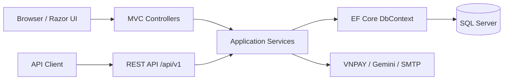

# OWE FashionHub

[](https://github.com/tanhung-05/FashionHub-OWE/actions/workflows/ci.yml)
[](https://dotnet.microsoft.com/)
[](https://oweshop.io.vn)

OWE FashionHub is a full-stack fashion e-commerce portfolio project built with
ASP.NET Core, Razor MVC, versioned REST APIs, Entity Framework Core, and SQL
Server. It covers the complete shopping flow, from product discovery and a
persistent cart to checkout, order tracking, payment processing, and store
administration.

The project started as a controller-heavy MVC application and is being migrated
incrementally toward an API-first modular monolith. The existing server-rendered
store remains usable while business rules move into application services shared
by both MVC and `/api/v1` controllers.

**Live store:** [https://oweshop.io.vn](https://oweshop.io.vn)

> The public deployment is a portfolio environment. Visitors can create a
> customer account and use the COD shopping flow. VNPAY, Gemini, and email
> features require deployment-specific sandbox credentials and may be disabled.

## Highlights

### Customer experience

- Browse, search, filter, and sort products by category, price, and availability.
- Select product colors and sizes with variant-level stock validation.
- Use a session cart as a guest and a SQL-backed persistent cart after login.
- Merge the guest cart into the customer cart during authentication.
- Manage Vietnamese delivery addresses with province, district, and ward data.
- Apply coupons and place orders using server-validated prices and inventory.
- Pay by cash on delivery or through the VNPAY sandbox integration.
- Track order history, view order details, cancel eligible orders, and review
  purchased products.
- Manage profile data, passwords, delivery addresses, and password recovery.
- Ask the optional Gemini-powered assistant about products and orders.

### Administration

- Dashboard with revenue, order, inventory, and customer summaries.
- Product, variant, image, category, and coupon management.
- Order processing with validated status transitions and inventory history.
- Customer account management and role-based authorization.
- Sales/customer reports, invoices, and spreadsheet exports.
- Versioned Admin APIs for products, orders, categories, coupons, customers,
  and dashboard reporting.

### Backend and operations

- API contracts use DTOs instead of exposing database-generated entities.
- Consistent `ProblemDetails` responses include a trace ID for diagnostics.
- Cookie authentication, BCrypt password hashing, role authorization, CSRF
  protection, rate limiting, and production security headers.
- SQL transactions and retry-aware execution strategies protect checkout and
  inventory updates.
- Docker Compose production stack with Caddy HTTPS, SQL Server Express, private
  backend networking, persistent volumes, health checks, and log rotation.
- GitHub Actions restores, builds, and runs the automated test suite on every
  push and pull request to `main`.

## Architecture



```text
FashionHub2/
|-- FashionHub.Web/
|   |-- Application/       Shared use cases, DTOs, and service interfaces
|   |-- Controllers/       MVC and versioned API controllers
|   |-- Areas/Admin/       Server-rendered administration workflows
|   |-- Data/              Database-first ApplicationDbContext
|   |-- Models/Generated/  Entities scaffolded from SQL Server
|   |-- Infrastructure/    Authentication, cart, email, and web concerns
|   |-- Services/          External integrations and legacy services
|   |-- Views/             Razor views and reusable partials
|   `-- wwwroot/           CSS, JavaScript, images, and uploaded products
|-- FashionHub.Tests/      MVC regression and API integration tests
|-- compose.production.yml
`-- docker-compose.yml
```

The application is intentionally a modular monolith. MVC and API controllers
call the same in-process application services; the server does not make HTTP
requests to itself.

## Technology Stack

| Area | Technology |
|---|---|
| Runtime | .NET 10, ASP.NET Core MVC and Web API |
| Data | EF Core 10, SQL Server 2022, database-first schema |
| UI | Razor, Bootstrap 5, JavaScript, jQuery |
| Authentication | Cookie authentication, BCrypt, role authorization, CSRF |
| Integrations | VNPAY 2.1.0 sandbox, Gemini API, SMTP |
| Testing | xUnit, WebApplicationFactory, FluentAssertions, EF Core InMemory |
| Delivery | Docker, Docker Compose, Caddy, GitHub Actions |

## Important Engineering Decisions

**Server-authoritative commerce rules.** The order service ignores totals,
prices, user IDs, and statuses supplied by the browser. It reloads product
variants from SQL Server, validates current stock and coupon rules, calculates
the final amount, and only clears the cart after the transaction succeeds.

**Cookie authentication for a same-origin application.** Both Razor pages and
the API use the same secure authentication cookie. Mutating API calls also
require an antiforgery token, avoiding two competing authentication systems
while the frontend and backend are deployed together.

**Incremental API-first migration.** Existing MVC routes continue to work while
Products, Cart, Authentication, Account, Orders, Chat, and Admin capabilities
are exposed through `/api/v1`. Shared services prevent duplicated business
rules and make a future SPA or mobile client possible.

**Database-first ownership.** `DB_Fixed.sql` is the source of truth for the
schema. Generated EF entities stay close to the database, while DTOs and
application services isolate public contracts from schema details.

## Quick Start With Docker

Requirements: Docker Desktop with Compose and Git.

```powershell
git clone https://github.com/tanhung-05/FashionHub-OWE.git
cd FashionHub-OWE/FashionHub2
Copy-Item .env.example .env
```

Before starting, edit `.env`:

- Set a strong `SA_PASSWORD`.
- Set `PUBLIC_BASE_URL=http://localhost:5167`.
- Clear optional placeholder credentials for Gemini, VNPAY, and SMTP when those
  integrations are not being tested.

```powershell
docker compose up -d --build
docker compose ps
```

Open:

- Store: [http://localhost:5167](http://localhost:5167)
- Health check: [http://localhost:5167/health](http://localhost:5167/health)
- Swagger (set `ASPNETCORE_ENVIRONMENT=Development`):
  [http://localhost:5167/swagger](http://localhost:5167/swagger)

The `db-init` service applies [`DB_Fixed.sql`](DB_Fixed.sql) after SQL Server is
healthy. Database data, product images, and Data Protection keys are stored in
Docker volumes.

## Run With The .NET CLI

Requirements: .NET 10 SDK and SQL Server.

1. Run [`DB_Fixed.sql`](DB_Fixed.sql) against SQL Server.
2. Configure the connection string with user secrets:

```powershell
cd FashionHub2/FashionHub.Web
dotnet user-secrets set "ConnectionStrings:DefaultConnection" "Server=localhost;Database=QL_SHOPQUANAO_PRO;Trusted_Connection=True;TrustServerCertificate=True"
dotnet run
```

The default development URLs are:

- HTTP: `http://localhost:5197`
- HTTPS: `https://localhost:7280`
- IIS Express: `https://localhost:44306`

Optional integration setup is documented in:

- [Gemini API configuration](docs/gemini-api-key-setup.md)
- [Password reset and SMTP](docs/password-reset-setup.md)
- [VNPAY sandbox](docs/vnpay-setup.md)

Never commit real passwords, API keys, SMTP credentials, or payment secrets.

## REST API

Representative endpoints:

| Method | Endpoint | Purpose |
|---|---|---|
| GET | `/api/v1/security/csrf-token` | Issue an antiforgery token |
| GET | `/api/v1/products` | Search and filter the catalog |
| GET | `/api/v1/products/{id}` | Read product and variant details |
| GET | `/api/v1/cart` | Read the current cart |
| POST | `/api/v1/cart/items` | Add a product variant |
| PUT/DELETE | `/api/v1/cart/items/{variantId}` | Update or remove a cart item |
| POST | `/api/v1/auth/register` | Register and create the auth cookie |
| POST | `/api/v1/auth/login` | Sign in and merge the guest cart |
| GET/PUT | `/api/v1/account/profile` | Read or update the current profile |
| GET/POST | `/api/v1/account/addresses` | Read or create owned addresses |
| PUT/DELETE | `/api/v1/account/addresses/{id}` | Update or delete an owned address |
| GET/POST | `/api/v1/orders` | Read or create customer orders |
| POST | `/api/v1/chat/messages` | Send a message to the assistant |
| GET/POST/PUT/DELETE | `/api/v1/admin/*` | Authorized administration APIs |

Mutation requests must include the authentication/antiforgery cookies and the
`X-CSRF-TOKEN` header returned by `/api/v1/security/csrf-token`.

The full request collection is available in
[`docs/postman`](docs/postman/README.md). Swagger exposes schemas, validation
rules, and response codes when the application runs in Development.

## Tests

```powershell
cd FashionHub2
dotnet restore
dotnet build
dotnet test --logger "console;verbosity=minimal"
```

The current suite contains 147 passing tests covering MVC regressions and
Products, Cart, Authentication, Account, Orders, Chat, and Admin API flows.
Tests use isolated in-memory databases and never connect to the configured
development or production database.

## Production Deployment

The live portfolio environment runs on a Linux VPS using:

- Caddy as the public reverse proxy with automatic HTTPS.
- ASP.NET Core and SQL Server in separate containers.
- A private Docker network for SQL Server; only ports 80 and 443 are public.
- Persistent volumes for SQL data, uploaded images, TLS state, and Data
  Protection keys.
- Health checks, restart policies, bounded container logs, and database backup
  storage.

See [Production VPS deployment](docs/production-vps-deployment.md) for the
operational runbook and [Deployment for beginners](docs/deployment-for-beginners.md)
for an explanation of domains, DNS, servers, containers, databases, secrets,
backups, and updates.

## Current Scope And Trade-offs

- VNPAY is a sandbox integration; no real customer payment should be made.
- The single-VPS deployment is suitable for a portfolio/demo or small trial,
  not a high-availability commerce platform.
- The optional image-similarity implementation is disabled because its current
  `System.Drawing` dependency is Windows-specific.
- Some complex Admin image/variant workflows still use legacy MVC logic and are
  candidates for further service extraction.
- SQL Server transaction behavior is verified by application and manual Docker
  testing; adding Testcontainers coverage is a planned improvement.

## Roadmap

- Add SQL Server Testcontainers tests for transactions and row-version conflicts.
- Add checkout idempotency to prevent duplicate submissions.
- Harden image upload validation and replace the Windows-only image service.
- Complete VNPAY refund handling for paid-order cancellation.
- Add centralized telemetry, external uptime alerts, and automated restore drills.
- Build a separate React or Vue client against the existing versioned API.

## Author

**Luong Tan Hung**

GitHub: [@tanhung-05](https://github.com/tanhung-05)

This repository was built as a software engineering and backend portfolio
project for internship applications.
